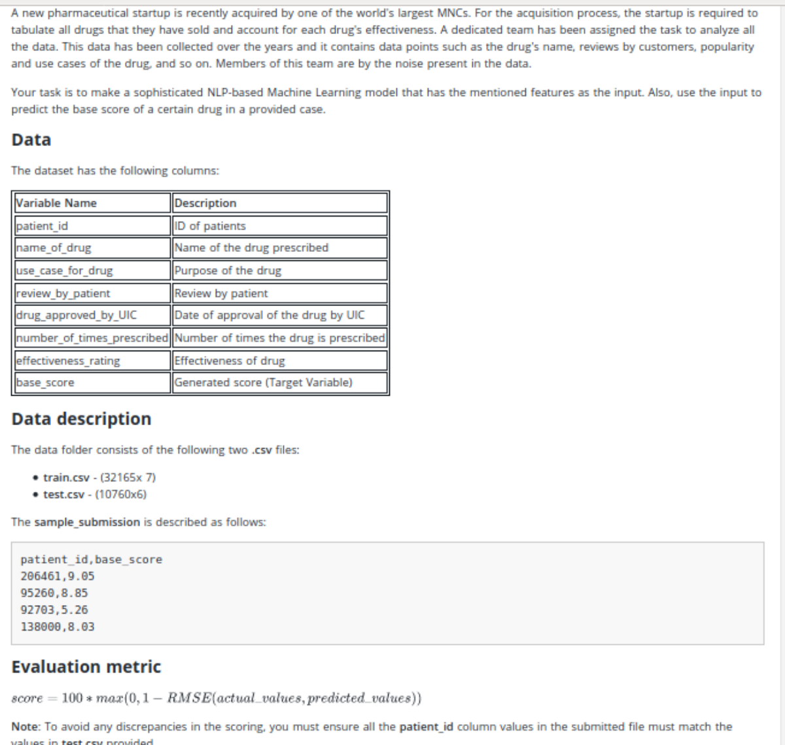

# interactive-ml-challenge-predict-effectiveness-of-std-drugs
This repository contains prediction related to effectiveness of STD drugs which has been solved as challenge give by Hacker Earth community.

### Problem Statement

Evaluation Algorithm Root Mean Square Error (RMSE) normalization_constant 100000 Datasets Training download train.csv Testing download test.csv Sample Submission download sample.csv

